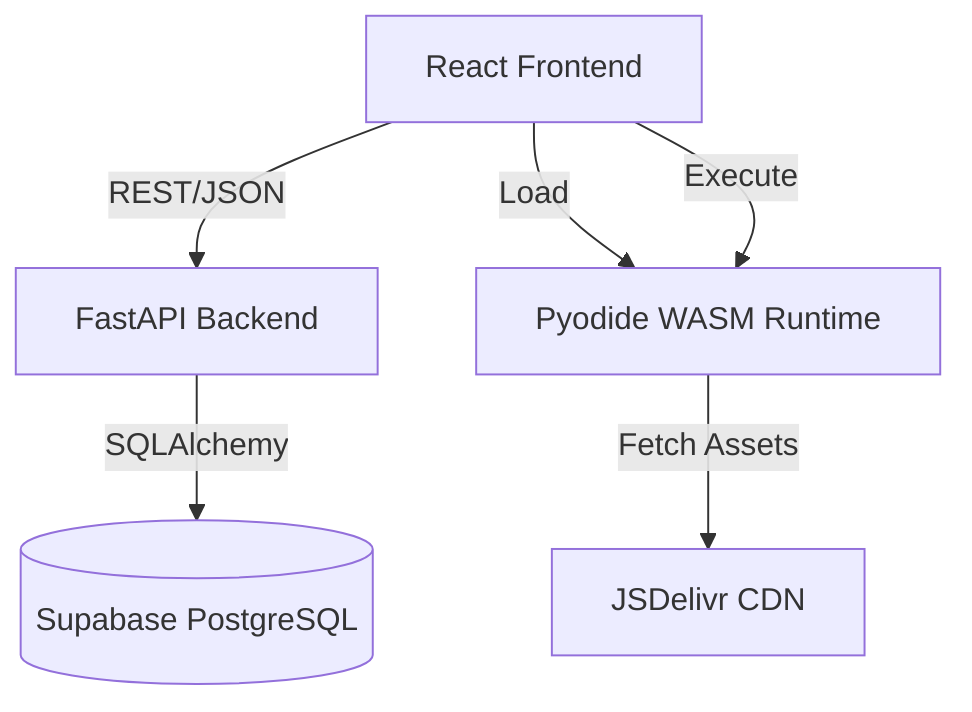

# Architecture Decision Document

_This document builds collaboratively through step-by-step discovery. Sections are appended as we work through each architectural decision together._

## Project Context Analysis

### Requirements Overview

**Functional Requirements:**
14 FRs focused on an Offline-First Learning Loop. The system behaves primarily as a Local PWA, with the Backend acting as a sync target. Key components include the Learning Engine (Task Tracking), the Pyodide Runtime (In-Browser Execution), and the Background Sync Manager.

**Non-Functional Requirements:**
*   **Performance:** TTI < 1.0s (Critical for retention). Pyodide init < 1.0s (Warm).
*   **Reliability:** Zero Data Loss. Local Storage is the Source of Truth.
*   **Accessibility:** WCAG AA Contrast and Keyboard Navigation (Editor Escape).

**Scale & Complexity:**
*   **Primary Domain:** Web / PWA / EdTech.
*   **Complexity Level:** Medium. Single-User focus simplifies backend, but "Offline-First" + "WASM Runtime" significantly increases frontend state complexity.
*   **Estimated Components:** ~12-15 (Dashboard, IDE, Transcript, Quiz, SyncManager, PyodideWorker, etc.)

### Technical Constraints & Dependencies

1.  **Local-First / PWA:** The backend is secondary. All critical user flows (Learning, Coding, Quizzing) MUST work without a network connection.
2.  **Pyodide Sandbox:** Executing user code in the browser requires strict version pinning, Web Worker isolation to prevent main-thread freezing, and robust error handling.
3.  **Schema Migration Safety:** We cannot break older clients who might be offline for weeks. API responses must be tolerant of missing fields, and DB migrations must be non-destructive.

### Cross-Cutting Concerns Identified

*   **Data Synchronization:** Implementing a robust "Last-Write-Wins" sync strategy with Optimistic UI updates.
*   **Error Handling:** Managing Pyodide crashes, network failures, and sync conflicts gracefully without disrupting the user flow.
*   **State Hydration:** Efficiently booting the application from `localStorage` to restore the user's exact context.

## Starter Template Evaluation

### Primary Technology Domain

Full-Stack Web App (PWA Focus) with WASM Runtime.

### Selected Starter: Existing Codebase

**Rationale for Selection:**
This is a brownfield project with a stable, functioning MVP. We are adopting the current codebase as our foundational "Starter" to maintain velocity and stability.

**Architectural Decisions Provided by Foundation:**

**Language & Runtime:**
*   **Frontend:** JavaScript (ESNext) running in Browser.
*   **Backend:** Python 3.10+ (FastAPI).
*   **WASM:** Pyodide `^0.24.1` pinned for consistent offline execution.

**Styling Solution:**
*   **Tailwind CSS 3.3:** Utility-first styling for rapid UI development.
*   **Design System:** Locally defined in `index.css` (CSS Variables for themes).

**Build Tooling:**
*   **Vite 5.0:** Fast HMR and optimized production builds.
*   **PostCSS:** For Tailwind processing.

**Testing Framework:**
*   **Playwright:** E2E testing standard (configured in `frontend/tests`).

**Code Organization:**
*   **Frontend:** Component-centric (`src/components`, `src/pages`) with context-based state (`src/contexts`).
*   **Backend:** Domain-driven routers (`app/routers`) with SQLAlchemy models (`app/models`).

**Development Experience:**
*   **Hot Reloading:** Vite (Frontend) + Uvicorn (Backend).
*   **Scripts:** `npm test` (E2E), `npm run dev` (Local Dev).

## Core Architectural Decisions

### Decision Priority Analysis

**Critical Decisions (Block Implementation):**
*   **Data Sync Strategy:** Last-Write-Wins (LWW) with Optimistic UI.
*   **State Management:** React Context + useReducer (No Redux).

**Important Decisions (Shape Architecture):**
*   **Local Persistence:** Dual-Strategy (localStorage + IndexedDB).

**Deferred Decisions (Post-MVP):**
*   **Server-Side Rendering (SSR):** Deferred. Simplifies deployment and reduces cost.
*   **WebSocket/Real-time:** Deferred. Sync is periodic/background-focused, not real-time chat.

### Data Architecture

*   **Sync Strategy:** Last-Write-Wins (LWW).
    *   **Rationale:** Simple, robust for single-user cross-device scenarios. Complexity of OT/CRDT is unjustified for this MVP.
    *   **Implementation:** Client sends local timestamp. Server accepts if `client_ts > server_ts`.
*   **Storage Hierarchy:**
    *   `localStorage`: Source of Truth for User Progress (Synchronous, blocking, immediate availability).
    *   `IndexedDB`: Secondary storage for Logs/Metrics/Audits (Asynchronous, bulk storage).
    *   `PostgreSQL`: Cloud Backup/Sync Target (Ultimate durability).

### Authentication & Security

*   **Auth Method:** Supabase Auth (JWT).
    *   **Rationale:** Integrated, secure, handles refresh tokens automatically.
*   **Offline Auth:** Functional "Guest" mode (or cached session) required for offline-first experience.

### API & Communication Patterns

*   **API Design:** RESTful (FastAPI).
    *   **Constraint:** Must support "Batch Sync" endpoints to minimize network roundtrips during weak connectivity.
*   **Error Handling:**
    *   **Client:** Queue and Retry (Exponential Backoff) for network errors.
    *   **Server:** 409 Conflict handling (though LWW mostly avoids this).

### Frontend Architecture

*   **State Management:** React Context + useReducer.
    *   **Rationale:** `SyncQueue` state has complex transitions (Pending -> Syncing -> Success/Failure) that `useState` handles poorly, but Redux is overkill.
*   **Component Pattern:** Container/Presentation Split.
    *   **Containers:** Handle Data/Sync logic (`SyncManager`).
    *   **Presentational:** Pure UI components (receive data via props).

### Infrastructure & Deployment

*   **Hosting:** Vercel (Frontend + API Proxy) + Supabase (Database).
    *   **Rationale:** Zero-config, globally distributed, free tier fits MVP.

### Decision Impact Analysis

**Implementation Sequence:**
1.  **Sync Foundation:** Implement `SyncContext` and `useSyncQueue`.
2.  **Storage Layer:** Implement `storageAdapter` (wrapping localStorage/IndexedDB).
3.  **API Update:** Implement Batch Sync endpoints.
4.  **UI Integration:** Connect generic hooks to UI components.

**Cross-Component Dependencies:**
*   The `SyncManager` is a singleton that touches every Write operation in the app. All "Save" buttons must route through `useSync()` instead of direct `fetch()`.

## Implementation Patterns & Consistency Rules

### Pattern Categories Defined

**Critical Conflict Points Identified:**
4 key areas where consistency is mandatory: Naming, Storage Keys, Sync Actions, and Error Structures.

### Naming Patterns

**Database/Storage Keys:**
*   **LocalStorage Rule:** `app_v1:{domain}:{key}`
    *   *Example:* `app_v1:learning:day_5_progress`
    *   *Why:* Prevents collisions and allows easy "Wipe V1" migration strategies.

**Sync Actions:**
*   **Convention:** `verb + Entity` (Logic) vs `ENTITY_ACTION` (Reducer).
*   **Action Example:** `{ type: 'SYNC_START', payload: { entity: 'tasks', id: 123 } }`

**Code Naming:**
*   **React Components:** `PascalCase` (e.g., `TaskCard.jsx`).
*   **Hooks/Logic:** `camelCase` (e.g., `useSyncQueue.js`).
*   **Python Modules:** `snake_case` (e.g., `sync_manager.py`).

### Structure Patterns

**Project Organization:**
*   **Feature-First:** `src/features/{domain}` (e.g., `features/quiz`) containing `components/`, `hooks/`, `utils/`.
*   **Shared UI:** `src/components/ui` for dumb atoms (Buttons, Cards).

### communication Patterns

**Error Handling:**
*   **Standard Object:** `{ message: string, code: string, retryable: boolean }`
*   **Constraint:** All Sync errors MUST have `retryable` flag to tell the Queue manager whether to Retry (Network Error) or Fail (Validation Error).

### Enforcement Guidelines

**All AI Agents MUST:**
1.  **NEVER** write to `localStorage` without the `app_v1:` prefix.
2.  **ALWAYS** use `useSync()` for data mutations.
3.  **NEVER** introduce Redux or generic Contexts for global state without Architect approval.

## Project Structure & Boundaries

### Complete Project Directory Structure

**Current Implementation (MVP):**

```
project-name/
├── README.md
├── package.json
├── backend/                  # Python/FastAPI Backend
│   ├── app/
│   │   ├── main.py           # Entry Point
│   │   ├── models.py         # SQLAlchemy Models
│   │   ├── schemas.py        # Pydantic Schemas
│   │   ├── routers/          # Domain Logic
│   │   │   ├── achievements.py
│   │   │   ├── badges.py
│   │   │   ├── progress.py
│   │   │   ├── quizzes.py
│   │   │   ├── reflections.py
│   │   │   ├── rpg.py
│   │   │   ├── tasks.py
│   │   │   └── weeks.py
│   │   └── utils/
│   ├── alembic/              # DB Migrations
│   └── tests/                # Backend API Tests
├── frontend/                 # React/Vite Frontend
│   ├── src/
│   │   ├── api/              # API Clients (client.js, quizApi.js)
│   │   ├── components/       # UI Components (40+ files)
│   │   ├── contexts/         # Global State (PyodideContext)
│   │   ├── hooks/            # Custom Hooks (usePythonRunner)
│   │   ├── lib/              # Core Utilities (supabase.js)
│   │   ├── pages/            # Route Pages (6 pages)
│   │   └── utils/            # Helpers
│   └── tests/                # E2E Tests (Playwright)
├── scripts/                  # Utility Scripts
│   ├── data/questions/       # Quiz JSON files (day-1 to day-25)
│   └── seed_supabase_questions.py
```

**Phase 2 Target Architecture (NOT IMPLEMENTED):**

> 🚧 The following Feature-Sliced Design structure is aspirational for Phase 2 when Local-First patterns are implemented.

```
frontend/src/
├── features/         # [PHASE 2] Domain Modules
│   ├── learning/     # Epic 1: Learning Loop
│   │   ├── components/
│   │   └── hooks/    # useTaskToggle, useDayProgress
│   ├── ide/          # Epic 2: Pyodide Runtime
│   │   ├── components/
│   │   └── worker/   # pyodide.worker.js
│   └── sync/         # Epic 3: Sync Logic
│       ├── SyncManager.js
│       └── useSyncQueue.js
└── lib/
    ├── db.js         # IndexedDB Wrapper
    └── storage.js    # LocalStorage Adapter
```

**Backend Phase 2 (NOT IMPLEMENTED):**

```
backend/app/routers/
└── sync.py           # [PHASE 2] Batch Sync Endpoints
```

### Architectural Boundaries

**API Boundaries:**
*   **External:** `/api/v1/*` (Proxied via Vercel).
*   **Internal:** `features/sync` acts as the *only* implementation allowed to talk to `POST /api/sync/batch`. All other features must write to local store.

**Component Boundaries:**
*   **Pages:** Composition roots that fetch data and pass it to Features.
*   **Features:** Smart containers that handle logic (e.g. `TaskList` uses `useTaskToggle`).
*   **UI:** Dumb components (e.g. `Checkbox`, `Button`) that receive props.

### Requirements to Structure Mapping

**Epic 1 (Learning Engine):**
*   **Location:** `src/features/learning/` + `app/routers/tasks.py`.
*   **Data:** `localStorage` (Progress) -> `tasks` table.

**Epic 2 (Browser Runtime):**
*   **Location:** `src/features/ide/` + `public/pyodide/`.
*   **Data:** Ephemeral (Memory) -> `IndexedDB` (Code History).

**Epic 3 (Sync Engine):**
*   **Location:** `src/features/sync/` + `app/routers/sync.py`.
*   **Data:** `localStorage` (Queue) -> `sync_logs` table.

### Integration Points

**Internal Communication:**
*   **Features -> Sync:** Features dispatch actions (e.g. `TASK_COMPLETED`) to `useSyncQueue`. They *never* call API directly.
*   **Sync -> API:** `SyncManager` drains the queue to `POST /api/sync/batch`.

**Data Flow:**
1.  **User Action** (Click Checkbox).
2.  **Optimistic UI** (Visual Toggle).
3.  **Local Commit** (Write to `localStorage`).
4.  **Sync Queue** (Push `{type: 'TASK_COMPLETE'}`).
5.  **Background Sync** (Send to API).
6.  **Reconciliation** (LWW check).

## Architecture Validation Results

### Coherence Validation ✅

**Decision Compatibility:**
The "Offline-First" strategy is consistently backed by the LWW Sync decision, IndexedDB storage pattern, and Feature-Based structure. No conflicts detected between the React Frontend and Python Backend for this architecture.

**Pattern Consistency:**
Naming conventions (PascalCase Components, camelCase logic) are standard and aligned with the chosen stack.

**Structure Alignment:**
The target "Feature-Sliced" structure directly supports the isolation requirements of the Epics (Learning vs IDE vs Sync).

### Requirements Coverage Validation ✅

**Epic/Feature Coverage:**
*   **Epic 1 (Learning):** Fully covered by `src/features/learning` and `app/routers/tasks.py`.
*   **Epic 2 (IDE):** Fully covered by `src/features/ide`, `public/pyodide`, and Web Worker separation.
*   **Epic 3 (Sync):** Fully covered by `src/features/sync` and `app/routers/sync.py`.

**Functional Requirements Coverage:**
All 14 FRs are architecturally supported.

**Non-Functional Requirements Coverage:**
*   **Performance:** LWW Sync + Optimistic UI supports <1s TTI.
*   **Reliability:** Offline-First persistence ensures Zero Data Loss.

### Implementation Readiness Validation ✅

**Decision Completeness:**
Critical decisions (Sync Strategy, State Management, Storage) are documented with specific constraints.

**Structure Completeness:**
Target directory structure is defined down to the file level for key components.

**Pattern Completeness:**
Critical patterns (Naming, Error Handling, Storage Keys) are defined.

### Gap Analysis Results

**Status Update (2025-12-13):** The original architecture described an ambitious Local-First PWA. After reviewing the deployed MVP, we've determined the current Server-First approach meets all user needs.

**Gap:** Local-First patterns (SyncManager, localStorage, Web Worker) are NOT implemented.
**Decision:** DEFERRED to Phase 2. Current MVP is complete and deployed.

### Architecture Readiness Assessment

**Overall Status:** MVP COMPLETE ✅

**Current Implementation:**
- Server-First architecture with FastAPI backend
- React frontend with direct API calls via `src/api/client.js`
- PostgreSQL (production) / SQLite (dev) persistence
- Pyodide running on main thread (functional, not isolated)
- Auto-deploy to Vercel on GitHub push

**Phase 2 Enhancements (Deferred):**
- Local-First / Offline capability
- SyncManager with Last-Write-Wins
- Web Worker for Pyodide isolation
- Feature-Sliced Design refactor

## Architecture Completion Summary

### Current Architecture (MVP - Deployed)

**📋 What's Implemented**
*   **Frontend:** React 18 + Vite, component-based structure (`src/components/`, `src/pages/`)
*   **Backend:** FastAPI with domain routers (`app/routers/`)
*   **Database:** SQLAlchemy ORM, Alembic migrations, Supabase (production)
*   **Deployment:** Vercel auto-deploy, CORS configured for production URL
*   **Features:** Dashboard, Planner, Practice (Quiz + Code Editor), Calendar, Progress, Reflections, RPG System

**🌐 Production URL:** https://learning-tracker-nu-tan.vercel.app

### Phase 2 Architecture (Future)

The following patterns from the original architecture are preserved for future enhancement:

*   **Local-First Persistence:** `useSync()` hook, localStorage with `app_v1:` prefix
*   **Sync Engine:** `SyncManager`, background queue, LWW conflict resolution
*   **Pyodide Hardening:** Web Worker isolation, `runtime_config.json`
*   **Feature-Sliced Design:** `src/features/learning`, `src/features/ide`, `src/features/sync`

### Implementation Handoff

**For AI Agents:**
The project_context.md contains the current implementation rules. This architecture document now serves as a reference for both current patterns AND future Phase 2 enhancements.

**Current Development:**
Use the existing structure (`src/components/`, `src/pages/`, `src/api/`). Follow patterns in `project_context.md`.

**Phase 2 Development (When Activated):**
Reference the original Epic structure in `docs/epics.md` for Local-First implementation.

### Quality Assurance Checklist

**✅ MVP Complete**
- [x] All core features functional
- [x] Deployed to production (Vercel)
- [x] Database migrations working (Alembic)
- [x] CORS properly configured
- [x] Content ingestion workflow operational

**⏸️ Phase 2 (Deferred)**
- [ ] Local-First persistence
- [ ] Offline capability
- [ ] Web Worker isolation
- [ ] Feature-Sliced Design refactor

---

**Architecture Status:** MVP COMPLETE ✅ | Phase 2 DEFERRED

**Last Updated:** 2025-12-15

---

## System Diagrams

### High-Level Architecture



### Data Flow: Task Completion

1. **User** clicks "Complete" on `TaskCard`.
2. **Frontend** sends `POST /api/tasks/{id}/complete`.
3. **API** verifies task existence and user status.
4. **API** calculates rewards (XP, Gold, Badges, Quest Damage).
5. **API** updates `User` and `UserTaskStatus` in **DB**.
6. **API** returns `TaskCompletionResult` (including new level, streak, etc.).
7. **Frontend** receives result and triggers animations (Level Up Modal, Confetti).
8. **Frontend** updates local Context with new user stats.

### Quiz Data Flow (Supabase Direct)

1. **User** navigates to `/practice` and selects a Day.
2. **Frontend** calls `quizApi.getQuestions(quizId)` → Supabase directly.
3. **Frontend** renders questions (MCQ, Coding, Code-Correction).
4. **User** submits answers.
5. **Frontend** calls `quizApi.submitQuiz()` → Supabase directly.
6. **Score** is calculated client-side and stored in Supabase.

> Note: Quiz API bypasses FastAPI backend for performance. See `frontend/src/api/quizApi.js`.


