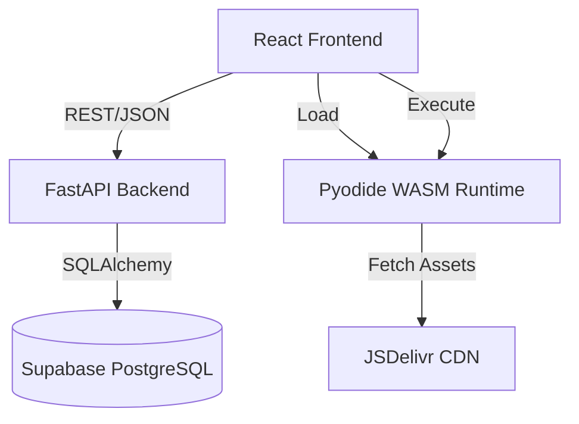

# System Architecture
Generated: 2025-12-10

## High-Level Overview

The system follows a standard 3-tier web architecture:
1.  **Client Tier:** React SPA (Vite) running in the user's browser.
2.  **API Tier:** FastAPI backend running on Render/Serverless.
3.  **Data Tier:** Supabase (PostgreSQL).

## Logic Distribution
- **Gamification Logic:** Centralized in Backend (`routers/tasks`, `utils/gamification`). Security-critical calculations (XP, Gold) happen here.
- **Code Execution:** Decentralized/Client-side. Python exercises run locally in the browser via **Pyodide**. The backend does *not* execute user code.
- **UI Logic:** React manages view state, routing, and optimistic UI updates for task completion.

## System Components

## Data Flow: Task Completion
1.  **User** clicks "Complete" on `TaskCard`.
2.  **Frontend** sends `POST /api/tasks/{id}/complete`.
3.  **API** verifies task existence and user status.
4.  **API** calculates rewards (XP, Gold, Badges, Quest Damage).
5.  **API** updates `User` and `UserTaskStatus` in **DB**.
6.  **API** returns `TaskCompletionResult` (including new level, streak, etc.).
7.  **Frontend** receives result and triggers animations (Level Up Modal, Confetti, XP tick up).
8.  **Frontend** updates local Context/Cache with new user stats.
