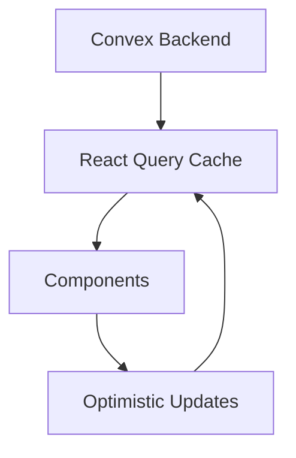

# Code Review & Improvement Plan

**Generated:** 2026-02-12  
**Scope:** Full codebase review (Frontend, Convex Backend, Tests)

---

## Executive Summary

This document outlines a comprehensive improvement plan based on a thorough review of the 100 Days of Code Learning Tracker codebase. The project is a well-architected full-stack application using React/Vite frontend with Convex backend. Several areas have been identified for improvement across code quality, maintainability, test coverage, and performance.

---

## 1. Frontend Improvements

### 1.1 Component Architecture

#### Issue: Large Component Files
Several components exceed recommended size limits, making them harder to maintain and test.

| File | Size | Recommendation |
|------|------|----------------|
| [`Dashboard.jsx`](frontend/src/pages/Dashboard.jsx) | 20K chars | Extract sub-components |
| [`Practice.jsx`](frontend/src/pages/Practice.jsx) | 13K chars | Extract tab content components |
| [`Quiz.jsx`](frontend/src/components/Quiz/Quiz.jsx) | 12K chars | Already partially refactored |
| [`Login.jsx`](frontend/src/pages/Login.jsx) | 16K chars | Split auth forms |

**Action Items:**
- [ ] Extract `NumberTicker` component from Dashboard to separate file
- [ ] Extract `GuestPracticePrompt` from Practice to `components/GuestPrompt.jsx`
- [ ] Create `components/auth/SignInForm.jsx` and `SignUpForm.jsx` from Login.jsx

#### Issue: Deep Dive Component Duplication
The [`DeepDive/`](frontend/src/components/content/DeepDive/) directory contains 100 individual day components (Day1.jsx - Day100.jsx), each with similar structure.

**Recommendation:** Create a data-driven DeepDive system:
```
components/content/DeepDive/
├── DeepDiveRenderer.jsx  # Single component
├── data/
│   ├── day1.js
│   ├── day2.js
│   └── ...
└── index.js
```

**Action Items:**
- [ ] Create `DeepDiveRenderer.jsx` component
- [ ] Extract content to data files
- [ ] Update [`DeepDiveLoader.jsx`](frontend/src/components/content/DeepDiveLoader.jsx) to use new system

### 1.2 Code Quality Issues

#### Issue: Duplicate ErrorBoundary
There are two ErrorBoundary implementations:
- [`App.jsx`](frontend/src/App.jsx:60) - Class component inline
- [`ErrorBoundary.jsx`](frontend/src/components/ErrorBoundary.jsx) - Separate file

**Action Items:**
- [ ] Remove inline ErrorBoundary from App.jsx
- [ ] Import from `components/ErrorBoundary.jsx`

#### Issue: Inconsistent Import Styles
Mixed usage of path aliases and relative imports:

```jsx
// Inconsistent examples found:
import { useAuth } from '../contexts/AuthContext'  // relative
import { Card } from '@/components/ui/card'         // alias
import { api } from "../../convex/_generated/api"   // relative
```

**Action Items:**
- [ ] Standardize on `@/` alias for all src imports
- [ ] Update jsconfig.json paths if needed
- [ ] Add ESLint rule to enforce import style

#### Issue: TypeScript Inconsistency
Tests use `.tsx` but components use `.jsx`, causing potential type safety gaps.

**Action Items:**
- [ ] Add JSDoc type annotations to components
- [ ] Consider gradual migration to TypeScript
- [ ] Add `@types` packages for better IDE support

### 1.3 Performance Optimizations

#### Issue: Missing Memoization
Large lists and expensive computations lack memoization.

**Action Items:**
- [ ] Add `useMemo` to derived data in Dashboard
- [ ] Add `React.memo` to list item components (TaskCard, BadgeCard)
- [ ] Implement virtualization for long lists (react-window)

#### Issue: Animation Performance
Framer Motion animations may cause layout thrashing.

**Action Items:**
- [ ] Use `layoutId` for shared element transitions
- [ ] Add `will-change` CSS property for animated elements
- [ ] Consider `AnimatePresence` exit animations optimization

---

## 2. Backend (Convex) Improvements

### 2.1 Type Safety

#### Issue: `any` Type Usage
Several functions use `any` type annotations:

```typescript
// convex/tasks.ts
export async function awardBadge(ctx: any, userId: Id<"users">, ...)
```

**Action Items:**
- [ ] Create proper typed context interface
- [ ] Replace `any` with specific types from Convex
- [ ] Add type guards for runtime validation

### 2.2 Code Duplication

#### Issue: Repeated User Lookup Pattern
The same user lookup code appears in multiple mutations:

```typescript
const user = await ctx.db
  .query("users")
  .withIndex("by_clerk_id", (q) => q.eq("clerk_user_id", clerkUserId))
  .unique();
```

**Action Items:**
- [ ] Create `getUserByClerkId` helper function
- [ ] Create `requireAuth` helper that throws if not authenticated
- [ ] Update all mutations to use helpers

### 2.3 Error Handling

#### Issue: Generic Error Messages
Errors lack specificity for debugging:

```typescript
if (!user) throw new Error("User not found");
```

**Action Items:**
- [ ] Create custom error classes (NotFoundError, UnauthorizedError)
- [ ] Add error codes for client-side handling
- [ ] Include request context in error messages

### 2.4 Schema Improvements

#### Issue: Missing Indexes
Some queries may benefit from additional indexes:

**Action Items:**
- [ ] Add index on `quizResults.by_user_and_date` for history queries
- [ ] Add composite index for common query patterns
- [ ] Review query performance in production

---

## 3. Test Coverage Improvements

### 3.1 Current Coverage Analysis

| Category | Files | Coverage |
|----------|-------|----------|
| E2E Tests | 6 specs | Good |
| Component Tests | 1 file | **Critical Gap** |
| Backend Tests | 8 files | Good |

### 3.2 Missing Test Coverage

#### Critical: Component Tests
Only [`LoginForm.test.tsx`](frontend/tests/component/LoginForm.test.tsx) exists for component testing.

**Action Items:**
- [ ] Add tests for `Quiz.jsx` component
- [ ] Add tests for `Dashboard.jsx` key functions
- [ ] Add tests for context providers (AuthContext, CourseContext)
- [ ] Add tests for hooks (usePythonRunner, useDayMeta)

#### Missing: Utility Tests
No tests for utility functions:

**Action Items:**
- [ ] Add tests for [`xpUtils.js`](frontend/src/utils/xpUtils.js)
- [ ] Add tests for [`textNormalize.js`](frontend/src/utils/textNormalize.js)
- [ ] Add tests for [`SoundManager.js`](frontend/src/utils/SoundManager.js)

### 3.3 Test Quality Improvements

**Action Items:**
- [ ] Add accessibility tests (jest-axe)
- [ ] Add visual regression tests (Playwright screenshots)
- [ ] Improve E2E test isolation with better fixtures

---

## 4. Architecture Improvements

### 4.1 State Management

#### Issue: Prop Drilling
Some data is passed through multiple component layers.

**Recommendation:** Consider using React Query or similar for server state:



**Action Items:**
- [ ] Evaluate React Query integration with Convex
- [ ] Create custom hooks for data fetching patterns
- [ ] Implement optimistic updates for better UX

### 4.2 Error Monitoring

#### Issue: No Error Tracking
Production errors are not tracked centrally.

**Action Items:**
- [ ] Integrate Sentry for error tracking
- [ ] Add source map uploads to build process
- [ ] Create error boundaries with reporting

### 4.3 Performance Monitoring

**Action Items:**
- [ ] Add Web Vitals tracking
- [ ] Implement performance budgets
- [ ] Add Lighthouse CI to PR checks

---

## 5. Documentation Improvements

### 5.1 Code Documentation

**Action Items:**
- [ ] Add JSDoc comments to all exported functions
- [ ] Create component storybook for UI documentation
- [ ] Document Convex function contracts

### 5.2 Architecture Documentation

**Action Items:**
- [ ] Update architecture diagrams
- [ ] Document deployment process
- [ ] Create runbook for common issues

---

## 6. Priority Matrix

### High Priority (Do First)
1. Remove duplicate ErrorBoundary
2. Create user lookup helper functions
3. Add component tests for Quiz and Dashboard
4. Standardize import styles

### Medium Priority
1. Extract large components
2. Add utility function tests
3. Implement error tracking
4. Create DeepDive data-driven system

### Low Priority (Nice to Have)
1. TypeScript migration
2. React Query integration
3. Performance monitoring
4. Storybook documentation

---

## 7. Implementation Order

```mermaid
flowchart LR
    subgraph Phase 1 - Quick Wins
        A1[Remove duplicate ErrorBoundary]
        A2[Standardize imports]
        A3[Add user lookup helpers]
    end
    
    subgraph Phase 2 - Testing
        B1[Component tests]
        B2[Utility tests]
        B3[Improve E2E coverage]
    end
    
    subgraph Phase 3 - Refactoring
        C1[Extract large components]
        C2[DeepDive data system]
        C3[Type safety improvements]
    end
    
    subgraph Phase 4 - Enhancements
        D1[Error tracking]
        D2[Performance monitoring]
        D3[Documentation]
    end
    
    Phase 1 --> Phase 2 --> Phase 3 --> Phase 4
```

---

## Next Steps

1. Review this plan with the team
2. Prioritize items based on current sprint goals
3. Create issues/tickets for approved items
4. Begin implementation in priority order
